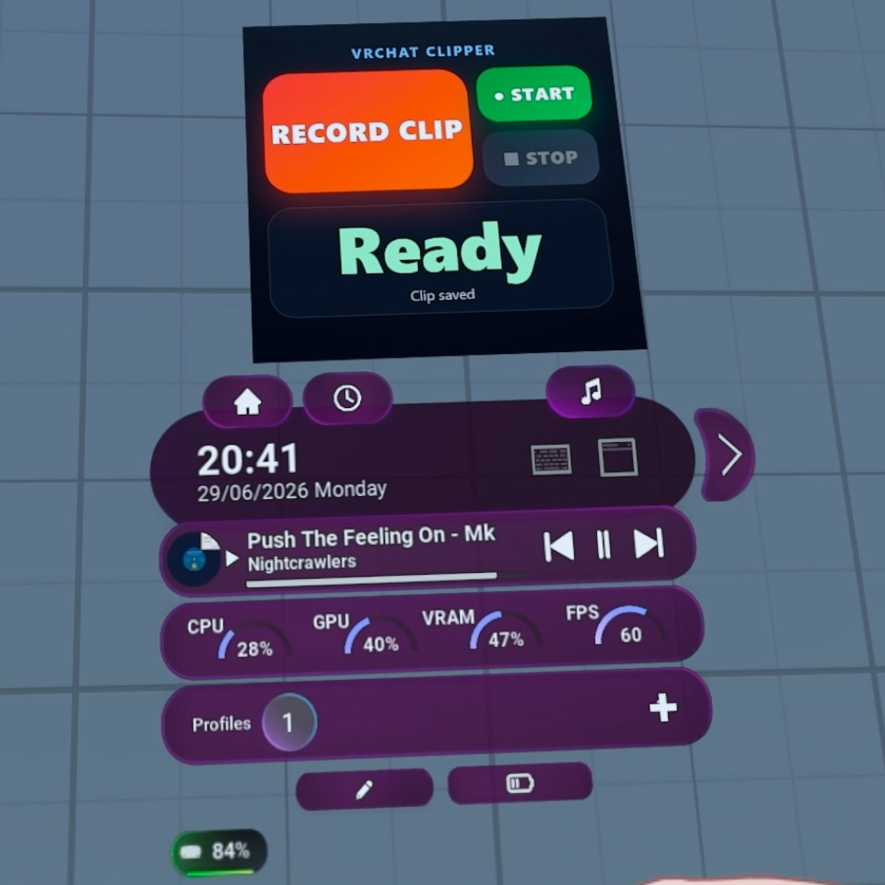

# vrchat-clipper

A small open-source tool for recording short VRChat clips on demand from a VR wrist
button. Wave at a friend, deliver a birthday message, capture a quick joke, and get a
neat 2–10 second recording out of OBS without taking off the headset or reaching for
the keyboard.

A wrist button triggers a local server that runs an in-headset countdown over VRChat
OSC and records the clip in OBS. There's also a free-form START / STOP mode for clips
of any length.

## Install

Pick one — all three end up at the same app:

- **[Guided install](docs/install-guided.md)** — run `vrchat-clipper.exe install` and
  it places the app, writes the config, copies the wrist button into OVR Toolkit, and
  registers with SteamVR. Easiest.
- **[Windows executable](docs/install-windows-exe.md)** — set the single `.exe` up by
  hand.
- **[Python package](docs/install-python.md)** — install with `pip` or run from
  source. Also covers building the releases.

## Set up

- **[One-time VRChat and OBS setup](docs/one-time-setup.md)** — the VRChat camera,
  OSC, OBS, and wrist-button steps the installer can't automate. Do it once.
- **[OBS setup](docs/obs-setup.md)** — the Spout2 capture source and OBS WebSocket in
  detail.
- **[OVR Toolkit wrist-button app](vrchat_clipper/ovr-custom-app/README.md)** —
  pinning the tile to your wrist.

## Reference

- **[Configuration reference](docs/configuration.md)** — every `config.json` field.
- **[How it works](docs/how-it-works.md)** — architecture, timing model, and the clip
  flow.
- **[Troubleshooting](docs/troubleshooting.md)** — fixes for common problems.
- **[Design notes and research](docs/DESIGN.md)** — background on how this was built.

## Requirements

The clipper drives other apps, so you need these whichever way you install it:

- A **Windows PC** running **SteamVR**.
- **VRChat**, with OSC enabled.
- **OBS Studio 28 or newer** (includes obs-websocket v5).
- **OVR Toolkit**, for the wrist button.
- The [Off-World-Live obs-spout2-plugin](https://github.com/Off-World-Live/obs-spout2-plugin),
  because OBS has no native Spout support on Windows.

The Windows executable needs nothing else. The Python package also needs **Python
3.10 or newer**.

## Acknowledgements

- [MissingNO123/OBS-Scripts-for-VRChat](https://github.com/MissingNO123/OBS-Scripts-for-VRChat) — prior art for VRChat OSC and OBS control.
- [python-osc](https://github.com/attwad/python-osc) — OSC messages.
- [obsws-python](https://github.com/aatikturk/obsws-python) — OBS WebSocket v5 control.
- [Off-World-Live obs-spout2-plugin](https://github.com/Off-World-Live/obs-spout2-plugin) — captures VRChat's Spout2 output in OBS.

## Licence

MIT, see [LICENSE](LICENSE).

## Disclaimer

vrchat-clipper is a community tool. It is not affiliated with, endorsed by, or
sponsored by VRChat Inc., OBS Studio, OVR Toolkit, or Off-World-Live.
