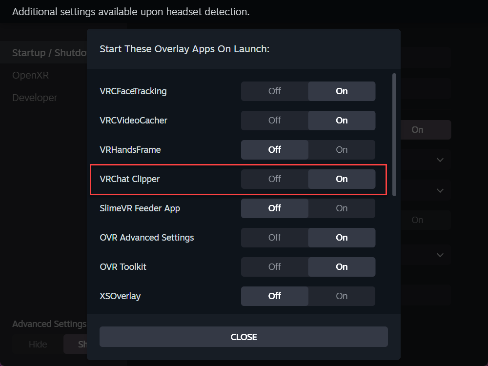

# Install with Python (pip or source)

Use this path if you already work in Python, want to run from a source checkout, or
plan to modify the code. If you just want the wrist button working with the least
fuss, the [Windows executable guide](install-windows-exe.md) is simpler.

The end result is identical either way: a local server at <http://127.0.0.1:8765/>
with the same Web UI, API, and wrist button.

## Before you start

The clipper drives other apps, so you need these installed regardless of how you
install the clipper itself:

- A Windows PC running **SteamVR**.
- **VRChat**, with OSC enabled.
- **OBS Studio 28 or newer** (this version bundles obs-websocket v5).
- **OVR Toolkit**, which draws the wrist button in VR.
- The [Off-World-Live obs-spout2-plugin](https://github.com/Off-World-Live/obs-spout2-plugin),
  because OBS has no built-in Spout support on Windows.

For the Python path you also need **Python 3.10 or newer**. Linux and macOS are fine
for development, but the runtime target is Windows with SteamVR.

You configure the VRChat and OBS side once after installing — see
[One-time VRChat and OBS setup](../README.md#one-time-vrchat-and-obs-setup).

## Option 1 — Install the wheel with pip

Grab `vrchat_clipper-<version>-py3-none-any.whl` from the
[Releases page](https://github.com/M1XZG/vrchat-clipper/releases), then install it
into a virtual environment:

```powershell
py -3 -m venv .venv
.venv\Scripts\python -m pip install vrchat_clipper-<version>-py3-none-any.whl
```

That gives you a `vrchat-clipper` command. Run it from the folder where you want
`config.json` to live:

```powershell
copy config.example.json config.json
vrchat-clipper
```

### Tray icon and SteamVR auto-launch

The base install runs a headless server. To get the system-tray icon and SteamVR
auto-launch registration, install the optional `desktop` extras:

```powershell
.venv\Scripts\python -m pip install "vrchat-clipper[desktop]"
```

That pulls in `pystray`, `Pillow`, and `openvr`. Without them the server still runs;
you just won't get the tray icon or the automatic SteamVR add-on entry.

## Option 2 — Run from a source checkout

Handy when you want to read or change the code:

```powershell
git clone https://github.com/M1XZG/vrchat-clipper.git
cd vrchat-clipper
py -3 -m venv .venv
.venv\Scripts\python -m pip install -r requirements.txt
copy config.example.json config.json
.venv\Scripts\python -m vrchat_clipper
```

On Windows you can double-click `run.bat` to do the same thing. On a Linux or macOS
dev machine, run `./run.sh`.

## Configure it

However you launched it, open <http://127.0.0.1:8765/> in a browser on the same PC
and set your clip length, OBS details, OSC options, and an optional output folder.
Saving writes `config.json` in the current working directory. Keep that file out of
version control — it may hold your OBS password, and the repo already gitignores it.

Every field is documented in the
[Configuration reference](../README.md#configuration-reference).

## Register with SteamVR

With the `desktop` extras installed, register the clipper so SteamVR launches it
automatically:

```powershell
vrchat-clipper --register-vr
```

It then appears under **SteamVR → Settings → Startup / Shutdown → Manage Add-Ons**
as **VRChat Clipper**:



Toggle it there whenever you want, or run `vrchat-clipper --unregister-vr` to remove
the entry.

### Command-line flags

Both the `vrchat-clipper` command and `python -m vrchat_clipper` accept these:

| Flag | Effect |
|---|---|
| `--no-tray` | Run a plain foreground server with no tray icon. |
| `--tray` | Force the system-tray icon (needs the `desktop` extras). |
| `--register-vr` | Register with SteamVR for auto-launch, then exit. |
| `--unregister-vr` | Remove the SteamVR auto-launch registration, then exit. |
| `--no-vr-register` | Start normally, but leave SteamVR registration untouched. |

## Add the wrist button in OVR Toolkit

The in-VR button is an OVR Toolkit custom app. Copy the
[`vrchat_clipper/ovr-custom-app/`](../vrchat_clipper/ovr-custom-app/) folder into
OVR Toolkit's `LocalCustomApps` folder and follow
[its README](../vrchat_clipper/ovr-custom-app/README.md); the full walk-through is in
[Install the OVR Toolkit Custom App](../README.md#4-install-the-ovr-toolkit-custom-app).

Once pinned, glancing at your wrist in VRChat shows the panel:


- **RECORD CLIP** runs the timed clip with the in-headset countdown.
- **START** and **STOP** capture a free-form clip of any length.
- The status line underneath shows what the tool is doing.

## One-time VRChat and OBS setup

Finish by configuring the VRChat camera, OBS, and OSC once:
[One-time VRChat and OBS setup](../README.md#one-time-vrchat-and-obs-setup).

## Building the release artifacts yourself

GitHub Actions builds both formats on a version tag such as `v0.2.1`
(`.github/workflows/release.yml`) and attaches them to a Release. To build locally:

**Python wheel and sdist** — works on any platform:

```sh
python -m pip install --upgrade build
python -m build            # -> dist/*.whl and dist/*.tar.gz
```

**Windows executable** — [PyInstaller](https://pyinstaller.org/) can only build for
the OS it runs on, so a Windows `.exe` must be built on Windows:

```powershell
py -3 -m venv .venv
.venv\Scripts\python -m pip install -r requirements.txt -r requirements-exe.txt
.venv\Scripts\pyinstaller --clean --noconfirm vrchat-clipper.spec
# -> dist\vrchat-clipper.exe
```

## If something isn't working

Common problems and fixes are in the
[Troubleshooting section](../README.md#troubleshooting) — the Web UI being
unreachable, the wrist tile not loading, OBS not connecting, and the countdown not
showing up.
